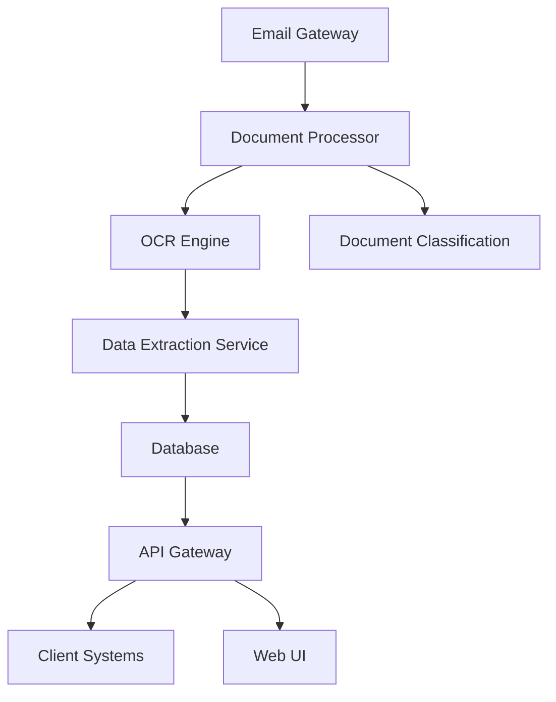
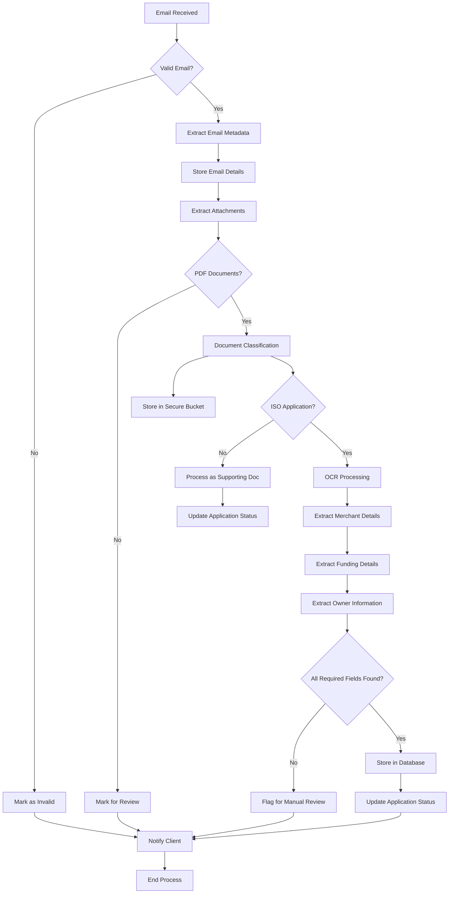
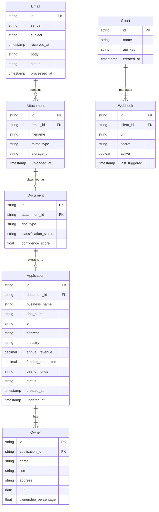
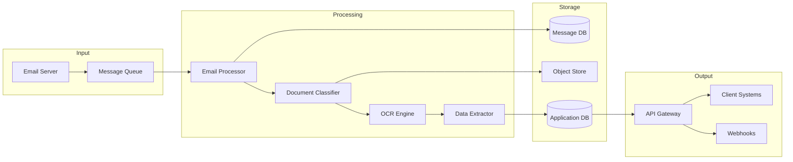

# 1. INTRODUCTION

## 1.1 Purpose

This Software Requirements Specification (SRS) document provides a comprehensive description of the Dollar Funding MCA Application Processing System. It details the functional and non-functional requirements for the development team, project stakeholders, and system architects. The document serves as the primary reference for technical and non-technical audiences to understand the system's capabilities, constraints, and implementation details.

## 1.2 Scope

The Dollar Funding MCA Application Processing System is a cloud-based solution designed to automate the processing of Merchant Cash Advance applications. The system will:

- Process incoming emails from brokers at submissions@dollarfunding.com
- Extract and store email metadata and attachments
- Classify different types of documents (ISO applications, bank statements, voided checks)
- Perform advanced OCR on ISO applications to extract:
  - Merchant details (Business name, DBA, EIN, address, industry, revenue)
  - Funding information (Amount requested, use of funds)
  - Owner information (Name, SSN, DOB, address, ownership percentage)
- Store processed data in secure databases
- Notify clients through webhooks about application status
- Provide both API and UI interfaces for:
  - Webhook management
  - Application data retrieval
  - Document viewing
  - Application status monitoring

The system aims to replace 93% of manual data entry operations, reducing the data entry team from 30 to 2 personnel while maintaining accuracy and improving processing speed. The solution will be built with high availability, scalability, and security as core architectural principles.

# 2. PRODUCT DESCRIPTION

## 2.1 Product Perspective

The Dollar Funding MCA Application Processing System operates as a standalone cloud-based service that integrates with Dollar Funding's existing email infrastructure and business processes. The system interfaces with:

- Email servers (receiving applications at submissions@dollarfunding.com)
- External document storage systems
- Client systems via REST APIs and webhooks
- Web browsers for UI access
- Authentication and authorization services

The system architecture follows a microservices pattern with the following components:



## 2.2 Product Functions

The system provides these core functions:

1. Email Processing
   - Automated email monitoring and retrieval
   - Metadata extraction and storage
   - Attachment handling

2. Document Management
   - PDF classification (ISO applications, bank statements, voided checks)
   - Secure document storage
   - Document retrieval and viewing

3. Data Extraction
   - Advanced OCR processing
   - Intelligent form field recognition
   - Data validation and verification

4. Integration Services
   - Webhook management
   - REST API endpoints
   - Status notifications

5. User Interface
   - Application monitoring dashboard
   - Document viewer
   - Webhook configuration
   - Search and filtering capabilities

## 2.3 User Characteristics

The system serves three primary user types:

1. System Administrators
   - Technical expertise: High
   - Responsibilities: System configuration, webhook management, API integration
   - Access level: Full system access

2. Data Entry Specialists
   - Technical expertise: Moderate
   - Responsibilities: Application review, error correction, quality control
   - Access level: Limited to application processing and review

3. Business Analysts
   - Technical expertise: Moderate
   - Responsibilities: Application monitoring, reporting, performance tracking
   - Access level: Read-only access to dashboards and reports

## 2.4 Constraints

1. Technical Constraints
   - Must process emails within 5 minutes of receipt
   - 99.9% system availability required
   - Maximum 30-second response time for API calls
   - Support for various PDF formats and quality levels

2. Regulatory Constraints
   - Compliance with data privacy regulations (GDPR, CCPA)
   - Secure storage of sensitive information (SSN, EIN)
   - Audit trail requirements for all data modifications

3. Business Constraints
   - Must achieve 93% automation rate
   - Processing accuracy must exceed 99%
   - System must scale to handle 10x current volume

## 2.5 Assumptions and Dependencies

Assumptions:
1. Email submissions will follow a consistent format
2. PDF documents will be machine-readable
3. Network connectivity between all system components will be reliable
4. Client systems can consume webhook notifications
5. Users have modern web browsers for UI access

Dependencies:
1. Email server availability and configuration
2. Cloud infrastructure services
3. OCR engine accuracy and performance
4. Third-party authentication services
5. Client system availability for webhook delivery
6. Database backup and recovery systems

## 2.6 Process Flowchart



# 3. FUNCTIONAL REQUIREMENTS

## 3.1 Email Processing Features

### F1: Email Monitoring and Retrieval
**Priority: Critical**

| ID | Requirement Description |
|---|---|
| F1.1 | System shall monitor submissions@dollarfunding.com continuously |
| F1.2 | System shall retrieve new emails within 1 minute of receipt |
| F1.3 | System shall extract email metadata (sender, subject, timestamp, body) |
| F1.4 | System shall validate email format and sender authenticity |
| F1.5 | System shall handle email attachments up to 25MB in size |

### F2: Email Storage and Tracking
**Priority: High**

| ID | Requirement Description |
|---|---|
| F2.1 | System shall store email metadata in a secure database |
| F2.2 | System shall assign unique identifiers to each email |
| F2.3 | System shall track email processing status (New, Processing, Completed, Failed) |
| F2.4 | System shall maintain email processing history |
| F2.5 | System shall support email retention policies |

## 3.2 Document Management Features

### F3: Document Classification
**Priority: Critical**

| ID | Requirement Description |
|---|---|
| F3.1 | System shall classify PDF attachments into categories (ISO Application, Bank Statement, Voided Check) |
| F3.2 | System shall validate PDF format and readability |
| F3.3 | System shall handle multiple attachments per email |
| F3.4 | System shall detect and flag corrupt or unreadable PDFs |
| F3.5 | System shall achieve 99% accuracy in document classification |

### F4: Document Storage
**Priority: High**

| ID | Requirement Description |
|---|---|
| F4.1 | System shall store documents in secure cloud storage |
| F4.2 | System shall maintain document versioning |
| F4.3 | System shall provide secure document access URLs |
| F4.4 | System shall enforce document access controls |
| F4.5 | System shall support document lifecycle management |

## 3.3 Data Extraction Features

### F5: OCR Processing
**Priority: Critical**

| ID | Requirement Description |
|---|---|
| F5.1 | System shall perform OCR on ISO applications |
| F5.2 | System shall handle handwritten text |
| F5.3 | System shall process skewed or imperfectly scanned documents |
| F5.4 | System shall achieve 95% accuracy in text extraction |
| F5.5 | System shall support multiple ISO application formats |

### F6: Data Extraction and Validation
**Priority: Critical**

| ID | Requirement Description |
|---|---|
| F6.1 | System shall extract merchant details (Business name, DBA, EIN, address, industry, revenue) |
| F6.2 | System shall extract funding information (Amount requested, use of funds) |
| F6.3 | System shall extract owner information (Name, SSN, DOB, address, ownership percentage) |
| F6.4 | System shall validate extracted data formats (SSN, EIN, dates) |
| F6.5 | System shall flag missing or invalid required fields |

## 3.4 Integration Features

### F7: Webhook Management
**Priority: High**

| ID | Requirement Description |
|---|---|
| F7.1 | System shall support webhook registration |
| F7.2 | System shall allow webhook URL updates |
| F7.3 | System shall support webhook authentication |
| F7.4 | System shall retry failed webhook deliveries |
| F7.5 | System shall maintain webhook delivery logs |

### F8: API Services
**Priority: High**

| ID | Requirement Description |
|---|---|
| F8.1 | System shall provide REST API endpoints for application data retrieval |
| F8.2 | System shall support secure API authentication |
| F8.3 | System shall implement rate limiting |
| F8.4 | System shall provide API documentation |
| F8.5 | System shall support API versioning |

## 3.5 User Interface Features

### F9: Application Dashboard
**Priority: Medium**

| ID | Requirement Description |
|---|---|
| F9.1 | System shall display application processing status |
| F9.2 | System shall provide document viewer |
| F9.3 | System shall support application search and filtering |
| F9.4 | System shall display extracted application data |
| F9.5 | System shall support data export functionality |

### F10: Webhook Configuration Interface
**Priority: Medium**

| ID | Requirement Description |
|---|---|
| F10.1 | System shall provide webhook configuration interface |
| F10.2 | System shall display webhook delivery status |
| F10.3 | System shall allow webhook testing |
| F10.4 | System shall display webhook history |
| F10.5 | System shall support webhook deletion |

# 4. NON-FUNCTIONAL REQUIREMENTS

## 4.1 Performance Requirements

| ID | Requirement Description | Target Metric |
|---|---|---|
| P1 | Email processing latency | < 5 minutes from receipt |
| P2 | Document classification speed | < 30 seconds per document |
| P3 | OCR processing time | < 60 seconds per application |
| P4 | API response time | < 500ms for 95th percentile |
| P5 | Webhook notification delivery | < 2 seconds |
| P6 | Concurrent user support | 500 simultaneous users |
| P7 | Document storage retrieval | < 3 seconds for any file size |
| P8 | Database query performance | < 100ms for standard queries |
| P9 | System resource utilization | < 80% CPU/memory usage |
| P10 | Batch processing capability | 10,000 applications per day |

## 4.2 Safety Requirements

| ID | Requirement Description |
|---|---|
| S1 | Automated backup system with 15-minute Recovery Point Objective (RPO) |
| S2 | Disaster recovery plan with 1-hour Recovery Time Objective (RTO) |
| S3 | Graceful degradation of services during partial system failures |
| S4 | Automatic failover for critical system components |
| S5 | Data corruption detection and prevention mechanisms |
| S6 | Transaction rollback capabilities for failed operations |
| S7 | Automated system health monitoring and alerting |
| S8 | Redundant storage for all critical data |
| S9 | Circuit breakers for external service dependencies |
| S10 | Automated data validation before permanent storage |

## 4.3 Security Requirements

| ID | Requirement Description |
|---|---|
| SE1 | Multi-factor authentication for all user access |
| SE2 | Role-based access control (RBAC) implementation |
| SE3 | AES-256 encryption for data at rest |
| SE4 | TLS 1.3 encryption for data in transit |
| SE5 | Secure storage of sensitive data (SSN, EIN) using HSM |
| SE6 | API authentication using JWT tokens |
| SE7 | Regular security audits and penetration testing |
| SE8 | Comprehensive audit logging of all system actions |
| SE9 | IP whitelisting for API access |
| SE10 | Automated vulnerability scanning |

## 4.4 Quality Requirements

### 4.4.1 Availability
- System uptime: 99.9% (excluding planned maintenance)
- Maximum planned downtime: 4 hours per month
- Redundant system components across multiple availability zones

### 4.4.2 Maintainability
- Modular architecture with loose coupling
- Comprehensive API documentation
- Automated deployment processes
- Monitoring and logging infrastructure
- Code coverage minimum of 80%

### 4.4.3 Usability
- Web interface compatible with modern browsers (Chrome, Firefox, Safari, Edge)
- Maximum of 3 clicks to reach any function
- Response feedback for all user actions
- Intuitive navigation and consistent UI elements
- Support for keyboard shortcuts

### 4.4.4 Scalability
- Horizontal scaling capability for all components
- Auto-scaling based on load metrics
- Support for 10x current volume without architecture changes
- Database partitioning capability
- Stateless application design

### 4.4.5 Reliability
- 99.99% accuracy in data extraction
- Zero data loss guarantee
- Automated error detection and reporting
- Fault tolerance for all critical components
- Self-healing capability for common issues

## 4.5 Compliance Requirements

| ID | Requirement Description |
|---|---|
| C1 | GDPR compliance for personal data handling |
| C2 | CCPA compliance for California residents |
| C3 | SOC 2 Type II certification |
| C4 | PCI DSS compliance for payment data |
| C5 | NIST cybersecurity framework alignment |
| C6 | Data retention policies compliance |
| C7 | Audit trail maintenance for 7 years |
| C8 | Regular compliance training for system operators |
| C9 | Privacy impact assessments documentation |
| C10 | Regular compliance reporting capabilities |

# 5. DATA REQUIREMENTS

## 5.1 Data Models



## 5.2 Data Storage

### 5.2.1 Database Requirements
- Primary database: PostgreSQL for structured data
- Document store: MongoDB for email content and metadata
- Object storage: AWS S3 for PDF documents and attachments

### 5.2.2 Data Retention
- Email metadata: 7 years
- Application data: 10 years
- PDF documents: 10 years
- Processing logs: 2 years
- Webhook delivery logs: 1 year

### 5.2.3 Backup Requirements
- Full database backup: Daily
- Incremental backups: Every 6 hours
- Point-in-time recovery capability: 30 days
- Cross-region backup replication
- Backup encryption using AES-256

### 5.2.4 Data Redundancy
- Database: Multi-AZ deployment
- Object storage: Cross-region replication
- 99.999999999% durability for all stored data
- Hot standby replicas in separate geographical regions

## 5.3 Data Processing

### 5.3.1 Data Flow



### 5.3.2 Data Security
- Encryption at rest for all databases
- TLS 1.3 for data in transit
- Field-level encryption for sensitive data (SSN, EIN)
- Data masking in logs and non-production environments
- Access control through IAM roles and policies

### 5.3.3 Data Validation
- Input validation for all API endpoints
- Schema validation for database operations
- Data type and format verification
- Business rule validation
- Duplicate detection and handling

### 5.3.4 Data Transformation
- PDF text extraction and normalization
- Address standardization
- Phone number formatting
- Currency amount normalization
- Date format standardization

### 5.3.5 Data Quality
- Confidence scoring for OCR results
- Data completeness checks
- Format validation
- Business rule compliance
- Automated data quality reporting

# 6. EXTERNAL INTERFACES

## 6.1 User Interfaces

### 6.1.1 Web Application Interface

| Component | Description |
|-----------|-------------|
| Login Screen | - Multi-factor authentication support<br>- Password reset functionality<br>- SSO integration capability |
| Application Dashboard | - Tabular view of all applications<br>- Status indicators (New, Processing, Complete, Failed)<br>- Search and filter capabilities<br>- Sortable columns |
| Document Viewer | - PDF rendering with zoom controls<br>- Side-by-side comparison view<br>- Document classification indicators<br>- Download functionality |
| Webhook Management | - Webhook URL configuration<br>- Secret key management<br>- Test webhook functionality<br>- Delivery status monitoring |
| Application Details | - Extracted merchant information display<br>- Owner information sections<br>- Funding details<br>- Processing status timeline |

### 6.1.2 Responsive Design Requirements

- Minimum supported resolutions: 1366x768 (desktop), 768x1024 (tablet)
- Support for modern browsers: Chrome 90+, Firefox 88+, Safari 14+, Edge 90+
- Mobile-responsive layouts for basic monitoring functions
- Touch-friendly interface elements for tablet users

## 6.2 Hardware Interfaces

### 6.2.1 Cloud Infrastructure

| Component | Specification |
|-----------|--------------|
| Compute Instances | - AWS EC2 t3.large minimum<br>- Auto-scaling group configuration<br>- Multi-AZ deployment |
| Storage | - AWS S3 for document storage<br>- EBS volumes for application storage<br>- Instance storage for temporary processing |
| Network | - AWS VPC with private subnets<br>- NAT Gateway for outbound traffic<br>- Application Load Balancer |

## 6.3 Software Interfaces

### 6.3.1 Email System Interface

```json
{
  "protocol": "IMAP-SSL",
  "authentication": "OAuth2",
  "polling_interval": "60 seconds",
  "retry_mechanism": {
    "max_attempts": 3,
    "backoff": "exponential"
  }
}
```

### 6.3.2 Document Storage Interface

```json
{
  "service": "AWS S3",
  "bucket_structure": {
    "raw": "/documents/raw/{yyyy}/{mm}/{dd}/{application_id}/",
    "processed": "/documents/processed/{yyyy}/{mm}/{dd}/{application_id}/"
  },
  "access_control": "IAM Roles",
  "encryption": "AES-256"
}
```

### 6.3.3 Database Interfaces

```json
{
  "primary_db": {
    "type": "PostgreSQL",
    "version": "13.x",
    "connection_pool": {
      "min_connections": 10,
      "max_connections": 100
    }
  },
  "document_store": {
    "type": "MongoDB",
    "version": "5.x",
    "replication": "enabled"
  }
}
```

## 6.4 Communication Interfaces

### 6.4.1 API Interface

| Endpoint Type | Protocol | Format | Authentication |
|--------------|----------|---------|----------------|
| REST API | HTTPS | JSON | JWT Bearer Token |
| Webhooks | HTTPS | JSON | HMAC Signature |
| File Transfer | HTTPS | Binary | Presigned URLs |

### 6.4.2 API Response Format

```json
{
  "standard_response": {
    "status": "success|error",
    "code": "HTTP_STATUS_CODE",
    "message": "string",
    "data": "object|array",
    "pagination": {
      "page": "integer",
      "per_page": "integer",
      "total": "integer"
    }
  }
}
```

### 6.4.3 Webhook Payload Format

```json
{
  "webhook_payload": {
    "event_type": "application.processed|application.review_needed",
    "timestamp": "ISO8601",
    "application_id": "string",
    "status": "string",
    "metadata": {
      "processing_time": "float",
      "confidence_score": "float",
      "document_count": "integer"
    }
  }
}
```

### 6.4.4 Network Requirements

- TLS 1.3 for all communications
- HTTP/2 support
- WebSocket support for real-time updates
- Maximum payload size: 25MB
- Connection timeout: 30 seconds
- Keep-alive enabled
- CORS configuration for web client

# APPENDICES

## A.1 GLOSSARY

| Term | Definition |
|------|------------|
| Merchant Cash Advance (MCA) | A type of business financing where a company purchases a portion of a merchant's future credit card sales |
| ISO Application | Independent Sales Organization application form used to collect merchant information for MCA funding |
| Webhook | HTTP callback that delivers real-time information to other applications |
| Document Classification | Process of categorizing documents into predefined types based on their content |
| Presigned URL | A URL that provides temporary access to private cloud storage objects |
| Data Entry Specialist | Personnel responsible for reviewing and correcting automated data extraction results |
| Processing Queue | System component that manages the order of application processing |

## A.2 ACRONYMS

| Acronym | Definition |
|---------|------------|
| MCA | Merchant Cash Advance |
| ISO | Independent Sales Organization |
| DBA | Doing Business As |
| EIN | Employer Identification Number |
| SSN | Social Security Number |
| DOB | Date of Birth |
| OCR | Optical Character Recognition |
| API | Application Programming Interface |
| UI | User Interface |
| JWT | JSON Web Token |
| HMAC | Hash-based Message Authentication Code |
| HSM | Hardware Security Module |
| RPO | Recovery Point Objective |
| RTO | Recovery Time Objective |
| RBAC | Role-Based Access Control |
| AES | Advanced Encryption Standard |
| TLS | Transport Layer Security |
| IAM | Identity and Access Management |
| VPC | Virtual Private Cloud |
| NAT | Network Address Translation |

## A.3 ADDITIONAL REFERENCES

1. AWS Documentation
   - S3 Security Best Practices
   - VPC Networking Guide
   - IAM Policy Reference

2. Security Standards
   - NIST Special Publication 800-53
   - OWASP Security Guidelines
   - Cloud Security Alliance Guidelines

3. Development Resources
   - PostgreSQL High Availability Guide
   - MongoDB Replication Documentation
   - OAuth 2.0 Implementation Guide

4. Industry Standards
   - ISO 27001 Information Security Management
   - PCI DSS Requirements for Financial Data
   - GDPR Compliance Guidelines