Based on the provided context and documentation, I'll generate the SYSTEM OVERVIEW and SCOPE sections for the INTRODUCTION. Note that I see these sections were already partially covered in sections 1.1 and 1.2, but I'll expand them with additional relevant details while maintaining consistency.

# INTRODUCTION

## SYSTEM OVERVIEW

The Dollar Funding MCA Application Processing System is an enterprise-grade, cloud-native solution designed to automate the processing of Merchant Cash Advance applications. The system comprises several interconnected components that work together to transform manual document processing into a streamlined, automated workflow:

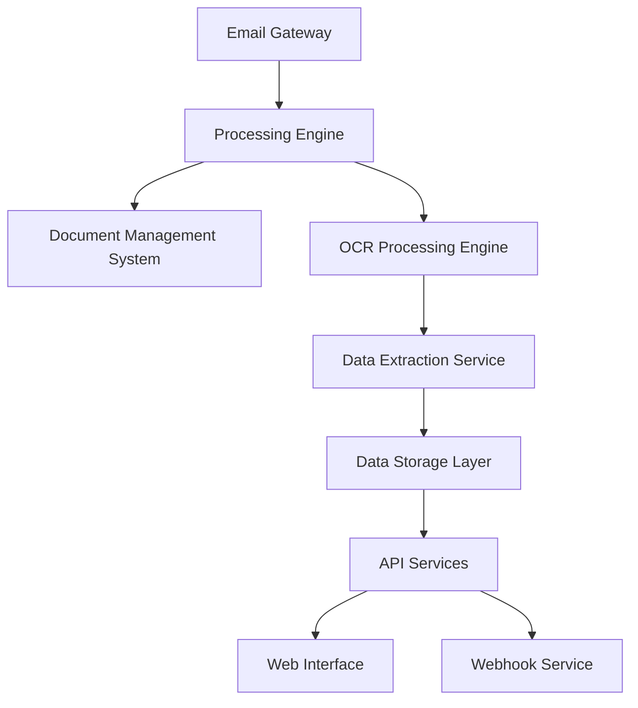
```mermaid
graph TD
    A[Email Gateway] --> B[Processing Engine]
    B --> C[Document Management System]
    B --> D[OCR Processing Engine]
    D --> E[Data Extraction Service]
    E --> F[Data Storage Layer]
    F --> G[API Services]
    G --> H[Web Interface]
    G --> I[Webhook Service]
```

The system's core components include:

1. Email Processing Subsystem
- Monitors submissions@dollarfunding.com
- Processes incoming broker submissions
- Extracts and validates attachments
- Manages email metadata storage

2. Document Processing Pipeline
- Advanced OCR engine for text extraction
- Machine learning-based document classification
- Intelligent form field recognition
- PDF processing and storage management

3. Data Management Layer
- PostgreSQL for structured application data
- MongoDB for document metadata
- S3-compatible object storage for documents
- Encrypted data storage with field-level security

4. Integration Layer
- RESTful API endpoints
- Webhook notification system
- Real-time status updates
- Secure authentication mechanisms

5. User Interface
- Web-based dashboard
- Document viewer
- Configuration management
- Status monitoring

## SCOPE

The system encompasses the following core functionalities and boundaries:

### In Scope:

1. Application Processing
- Automated email monitoring and retrieval
- PDF document classification and storage
- OCR processing of ISO applications
- Extraction of merchant details:
  * Business legal name and DBA
  * Federal Tax ID/EIN
  * Business address and industry
  * Revenue information
- Extraction of funding details:
  * Requested funding amount
  * Use of funds
- Extraction of owner information:
  * Personal details (name, SSN, DOB)
  * Address information
  * Ownership percentage

2. Integration Capabilities
- REST API for application data access
- Configurable webhook notifications
- Status update mechanisms
- Secure document access

3. User Interface
- Application monitoring dashboard
- Document viewing capabilities
- Webhook management interface
- Search and filtering functionality

4. Security and Compliance
- Data encryption at rest and in transit
- Role-based access control
- Audit logging
- Compliance with financial regulations

### Out of Scope:

1. Application Decision Making
- Credit scoring
- Risk assessment
- Funding approval decisions

2. Financial Processing
- Payment processing
- Fund disbursement
- Collection management

3. Broker Management
- Broker onboarding
- Commission calculations
- Broker portal access

4. Customer Relationship Management
- Customer support ticketing
- Communication management
- Marketing automation

The system is designed to replace 93% of manual data entry operations while maintaining high accuracy and improving processing speed, ultimately reducing the data entry team from 30 to 2 personnel.

# SYSTEM ARCHITECTURE

## Overview

The Dollar Funding MCA Application Processing System follows a microservices architecture deployed on AWS cloud infrastructure. The system is designed for high availability, scalability, and fault tolerance.

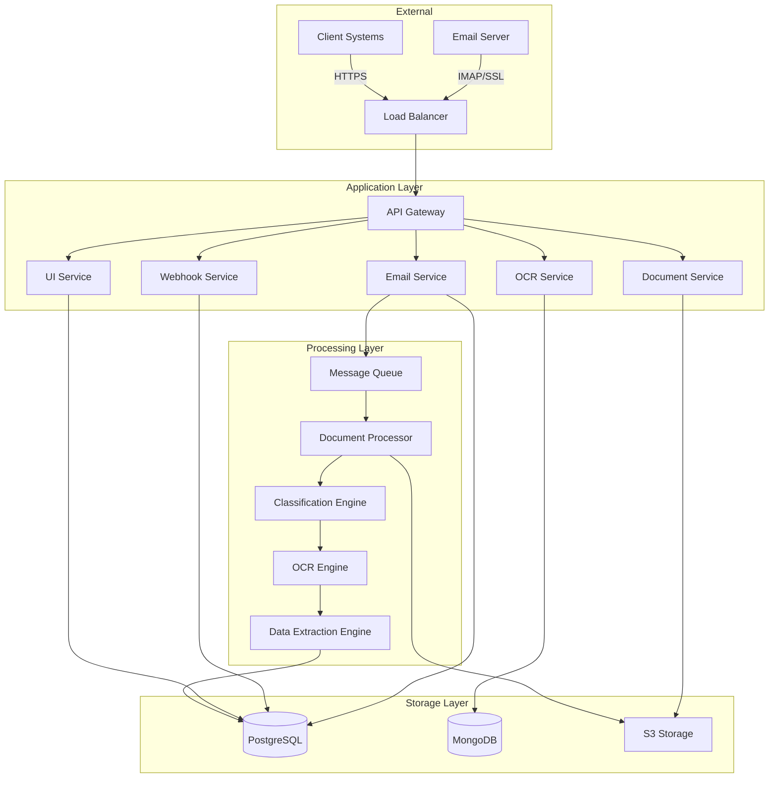
```mermaid
graph TB
    subgraph External
        A[Email Server] --> |IMAP/SSL| B[Load Balancer]
        Z[Client Systems] --> |HTTPS| B
    end
    
    subgraph Application Layer
        B --> C[API Gateway]
        C --> D[Email Service]
        C --> E[Document Service]
        C --> F[OCR Service]
        C --> G[Webhook Service]
        C --> H[UI Service]
    end
    
    subgraph Processing Layer
        D --> I[Message Queue]
        I --> J[Document Processor]
        J --> K[Classification Engine]
        K --> L[OCR Engine]
        L --> M[Data Extraction Engine]
    end
    
    subgraph Storage Layer
        N[(PostgreSQL)]
        O[(MongoDB)]
        P[S3 Storage]
    end
    
    D --> N
    E --> P
    F --> O
    G --> N
    H --> N
    J --> P
    M --> N
```

## Component Details

### Frontend Layer

| Component | Technology | Purpose |
|-----------|------------|----------|
| Load Balancer | AWS ALB | Request distribution and SSL termination |
| API Gateway | AWS API Gateway | API management and request routing |
| UI Service | Node.js/React | Web interface delivery |

### Application Services

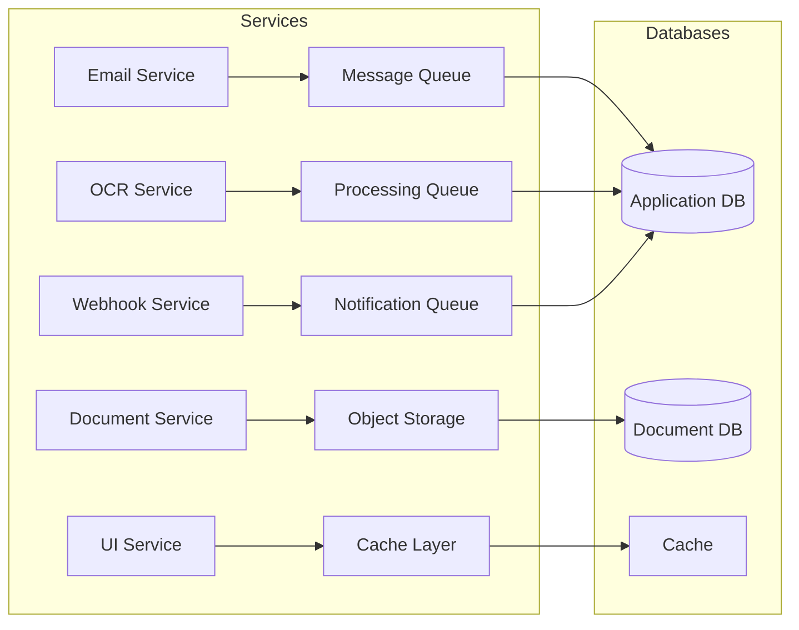
```mermaid
graph LR
    subgraph Services
        A[Email Service] --> B[Message Queue]
        C[Document Service] --> D[Object Storage]
        E[OCR Service] --> F[Processing Queue]
        G[Webhook Service] --> H[Notification Queue]
        I[UI Service] --> J[Cache Layer]
    end
    
    subgraph Databases
        K[(Application DB)]
        L[(Document DB)]
        M[Cache]
    end
    
    B --> K
    D --> L
    F --> K
    H --> K
    J --> M
```

### Processing Pipeline

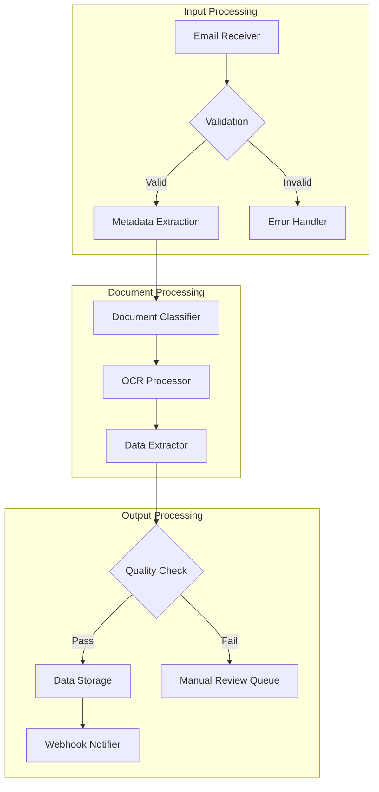
```mermaid
graph TD
    subgraph Input Processing
        A[Email Receiver] --> B{Validation}
        B -->|Valid| C[Metadata Extraction]
        B -->|Invalid| D[Error Handler]
    end
    
    subgraph Document Processing
        C --> E[Document Classifier]
        E --> F[OCR Processor]
        F --> G[Data Extractor]
    end
    
    subgraph Output Processing
        G --> H{Quality Check}
        H -->|Pass| I[Data Storage]
        H -->|Fail| J[Manual Review Queue]
        I --> K[Webhook Notifier]
    end
```

## Infrastructure Components

### Compute Resources

- **Application Servers**
  - Type: AWS EC2 t3.large
  - Auto-scaling enabled
  - Multi-AZ deployment
  - Minimum 3 instances per service

- **Processing Nodes**
  - Type: AWS EC2 c5.2xlarge
  - GPU support for OCR
  - Spot instances for batch processing
  - Auto-scaling based on queue depth

### Storage Resources

- **Document Storage**
  - S3 Standard for active documents
  - S3 IA for archived documents
  - Versioning enabled
  - Cross-region replication

- **Database Clusters**
  - PostgreSQL 13.x RDS Multi-AZ
  - MongoDB 5.x Atlas Cluster
  - Read replicas for scaling

### Network Architecture

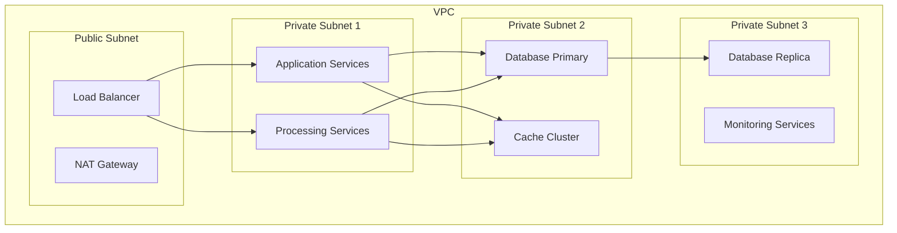
```mermaid
graph TB
    subgraph VPC
        subgraph Public Subnet
            A[Load Balancer]
            B[NAT Gateway]
        end
        
        subgraph Private Subnet 1
            C[Application Services]
            D[Processing Services]
        end
        
        subgraph Private Subnet 2
            E[Database Primary]
            F[Cache Cluster]
        end
        
        subgraph Private Subnet 3
            G[Database Replica]
            H[Monitoring Services]
        end
    end
    
    A --> C
    A --> D
    C --> E
    D --> E
    E --> G
    C --> F
    D --> F
```

## Security Architecture

### Network Security

- VPC isolation with private subnets
- Security groups for service-level access control
- Network ACLs for subnet-level control
- VPC endpoints for AWS services
- WAF for API and UI protection

### Data Security

- TLS 1.3 for all communications
- AES-256 encryption at rest
- Field-level encryption for sensitive data
- Key management through AWS KMS
- Regular security audits and penetration testing

### Authentication & Authorization

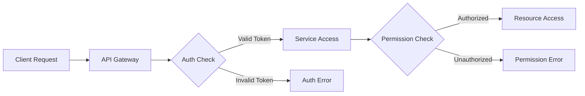
```mermaid
graph LR
    A[Client Request] --> B[API Gateway]
    B --> C{Auth Check}
    C -->|Valid Token| D[Service Access]
    C -->|Invalid Token| E[Auth Error]
    D --> F{Permission Check}
    F -->|Authorized| G[Resource Access]
    F -->|Unauthorized| H[Permission Error]
```

## Monitoring & Logging

- CloudWatch for metrics and alerts
- ELK stack for log aggregation
- Prometheus for service metrics
- Grafana for visualization
- X-Ray for distributed tracing

## Disaster Recovery

- Multi-region deployment capability
- Automated backups with point-in-time recovery
- Regular disaster recovery testing
- Business continuity plan with RPO/RTO targets
- Automated failover procedures

# SYSTEM COMPONENTS ARCHITECTURE

## Component Diagrams

### Core System Components

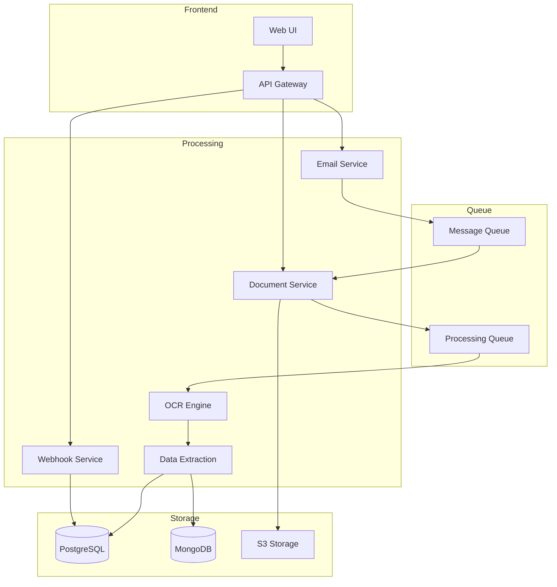
```mermaid
graph TB
    subgraph Frontend
        A[Web UI]
        B[API Gateway]
    end
    
    subgraph Processing
        C[Email Service]
        D[Document Service]
        E[OCR Engine]
        F[Data Extraction]
        G[Webhook Service]
    end
    
    subgraph Storage
        H[(PostgreSQL)]
        I[(MongoDB)]
        J[S3 Storage]
    end
    
    subgraph Queue
        K[Message Queue]
        L[Processing Queue]
    end
    
    A --> B
    B --> C
    B --> D
    B --> G
    
    C --> K
    K --> D
    D --> L
    L --> E
    E --> F
    F --> H
    
    D --> J
    F --> I
    G --> H
```

### Service Dependencies

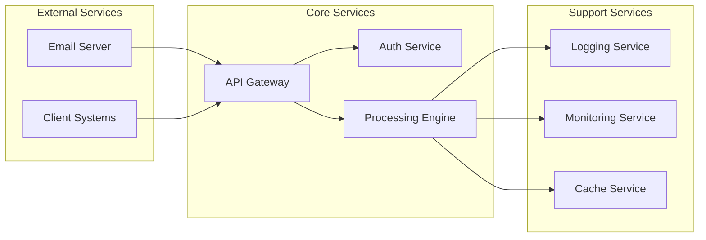
```mermaid
graph LR
    subgraph External Services
        A[Email Server]
        B[Client Systems]
    end
    
    subgraph Core Services
        C[API Gateway]
        D[Auth Service]
        E[Processing Engine]
    end
    
    subgraph Support Services
        F[Logging Service]
        G[Monitoring Service]
        H[Cache Service]
    end
    
    A --> C
    B --> C
    C --> D
    C --> E
    E --> F
    E --> G
    E --> H
```

## Sequence Diagrams

### Email Processing Flow

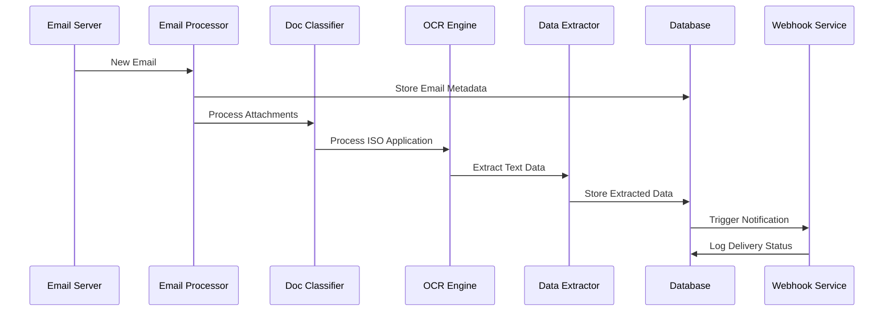
```mermaid
sequenceDiagram
    participant ES as Email Server
    participant EP as Email Processor
    participant DC as Doc Classifier
    participant OCR as OCR Engine
    participant DE as Data Extractor
    participant DB as Database
    participant WH as Webhook Service
    
    ES->>EP: New Email
    EP->>DB: Store Email Metadata
    EP->>DC: Process Attachments
    DC->>OCR: Process ISO Application
    OCR->>DE: Extract Text Data
    DE->>DB: Store Extracted Data
    DB->>WH: Trigger Notification
    WH->>DB: Log Delivery Status
```

### API Request Flow

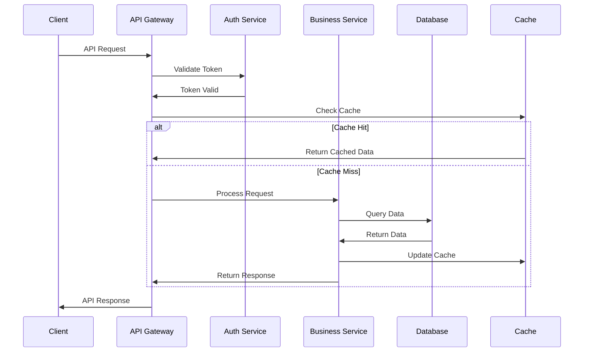
```mermaid
sequenceDiagram
    participant C as Client
    participant AG as API Gateway
    participant AS as Auth Service
    participant BS as Business Service
    participant DB as Database
    participant CH as Cache
    
    C->>AG: API Request
    AG->>AS: Validate Token
    AS->>AG: Token Valid
    AG->>CH: Check Cache
    alt Cache Hit
        CH->>AG: Return Cached Data
    else Cache Miss
        AG->>BS: Process Request
        BS->>DB: Query Data
        DB->>BS: Return Data
        BS->>CH: Update Cache
        BS->>AG: Return Response
    end
    AG->>C: API Response
```

## Data Flow Diagrams

### Primary Data Flow

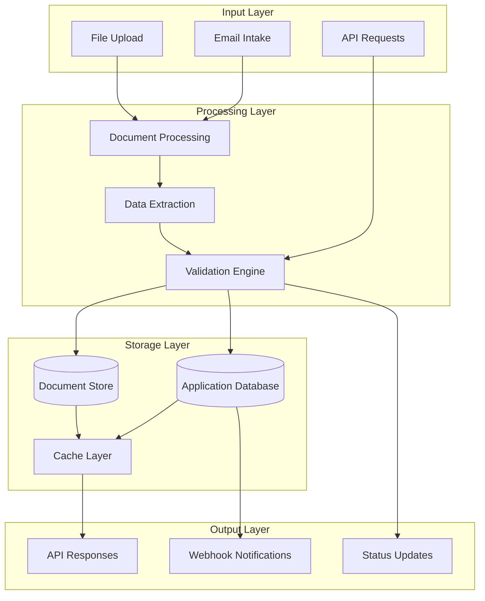
```mermaid
graph TD
    subgraph Input Layer
        A[Email Intake]
        B[API Requests]
        C[File Upload]
    end
    
    subgraph Processing Layer
        D[Document Processing]
        E[Data Extraction]
        F[Validation Engine]
    end
    
    subgraph Storage Layer
        G[(Application Database)]
        H[(Document Store)]
        I[Cache Layer]
    end
    
    subgraph Output Layer
        J[API Responses]
        K[Webhook Notifications]
        L[Status Updates]
    end
    
    A --> D
    B --> F
    C --> D
    
    D --> E
    E --> F
    F --> G
    F --> H
    
    G --> I
    H --> I
    
    I --> J
    G --> K
    F --> L
```

### Document Processing Flow

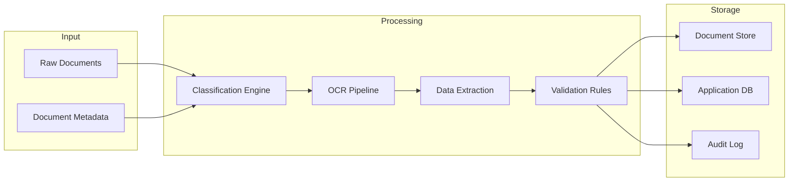
```mermaid
graph LR
    subgraph Input
        A[Raw Documents]
        B[Document Metadata]
    end
    
    subgraph Processing
        C[Classification Engine]
        D[OCR Pipeline]
        E[Data Extraction]
        F[Validation Rules]
    end
    
    subgraph Storage
        G[Document Store]
        H[Application DB]
        I[Audit Log]
    end
    
    A --> C
    B --> C
    C --> D
    D --> E
    E --> F
    F --> G
    F --> H
    F --> I
```

| Component | Technology | Purpose | Dependencies |
|-----------|------------|---------|--------------|
| Email Service | Node.js | Email processing and metadata extraction | AWS SES, PostgreSQL |
| Document Service | Python | Document classification and storage | AWS S3, MongoDB |
| OCR Engine | Python/TensorFlow | Text extraction and processing | GPU Infrastructure |
| Data Extraction | Python/spaCy | Field identification and validation | PostgreSQL |
| API Gateway | AWS API Gateway | Request routing and authentication | Auth Service |
| Web UI | React | User interface and interaction | API Gateway |
| Message Queue | RabbitMQ | Asynchronous task processing | None |
| Cache Layer | Redis | Performance optimization | None |
| Webhook Service | Node.js | External notifications | PostgreSQL |

# TECHNOLOGY STACK

## PROGRAMMING LANGUAGES

| Layer | Language | Justification |
|-------|----------|---------------|
| Backend Services | Python 3.9+ | - Strong OCR/ML library ecosystem<br>- Excellent data processing capabilities<br>- High developer productivity |
| Frontend | TypeScript 4.8+ | - Type safety for complex state management<br>- Enhanced developer tooling<br>- Better maintainability |
| Infrastructure | HCL (Terraform) | - Industry standard for IaC<br>- AWS provider maturity<br>- Version controlled infrastructure |
| Data Processing | Python 3.9+ | - Rich data manipulation libraries<br>- Strong ML/AI ecosystem<br>- Excellent PDF processing tools |

## FRAMEWORKS AND LIBRARIES

### Backend Framework Stack

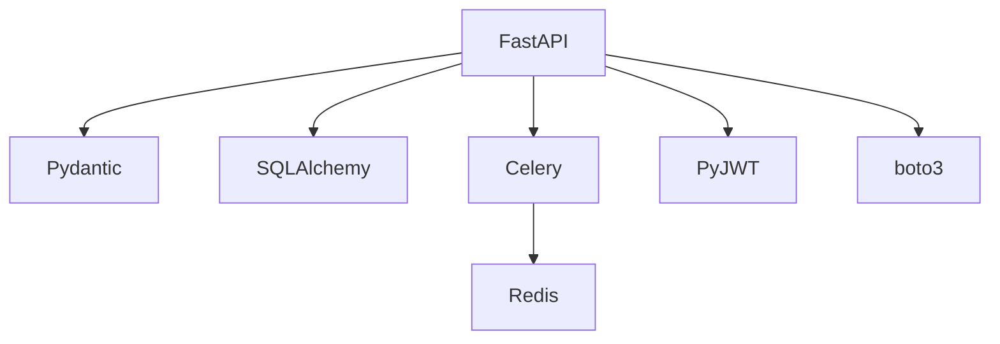
```mermaid
graph TD
    A[FastAPI] --> B[Pydantic]
    A --> C[SQLAlchemy]
    A --> D[Celery]
    D --> E[Redis]
    A --> F[PyJWT]
    A --> G[boto3]
```

| Component | Version | Purpose |
|-----------|---------|----------|
| FastAPI | 0.95+ | High-performance API framework with automatic OpenAPI docs |
| Pydantic | 2.0+ | Data validation and settings management |
| SQLAlchemy | 2.0+ | ORM for database interactions |
| Celery | 5.3+ | Distributed task queue for async processing |
| PyTesseract | 0.3+ | OCR processing engine |
| spaCy | 3.5+ | NLP for text extraction and analysis |
| boto3 | 1.26+ | AWS SDK for Python |

### Frontend Framework Stack

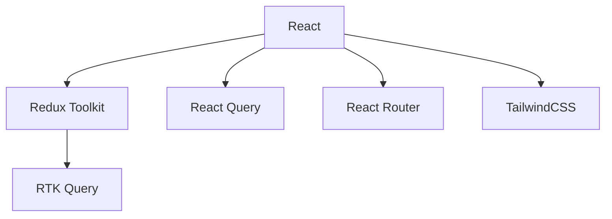
```mermaid
graph TD
    A[React] --> B[Redux Toolkit]
    A --> C[React Query]
    A --> D[React Router]
    B --> E[RTK Query]
    A --> F[TailwindCSS]
```

| Component | Version | Purpose |
|-----------|---------|----------|
| React | 18.2+ | UI framework |
| Redux Toolkit | 1.9+ | State management |
| React Query | 4.0+ | Server state management |
| TailwindCSS | 3.3+ | Utility-first CSS framework |
| React Router | 6.8+ | Client-side routing |
| PDF.js | 3.4+ | PDF rendering |

## DATABASES

### Primary Data Store

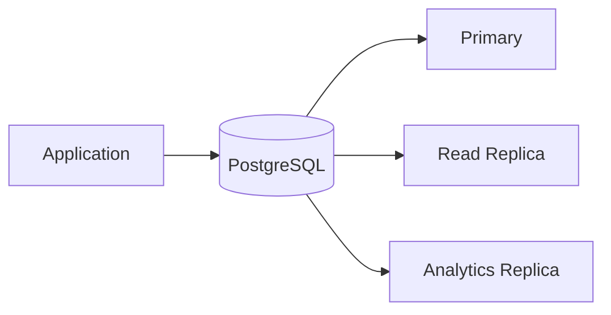
```mermaid
graph LR
    A[Application] --> B[(PostgreSQL)]
    B --> C[Primary]
    B --> D[Read Replica]
    B --> E[Analytics Replica]
```

| Database | Version | Purpose |
|----------|---------|----------|
| PostgreSQL | 13.x | Primary application database |
| MongoDB | 5.x | Document metadata storage |
| Redis | 6.x | Caching and message queue |
| AWS S3 | N/A | Document storage |

### Schema Overview

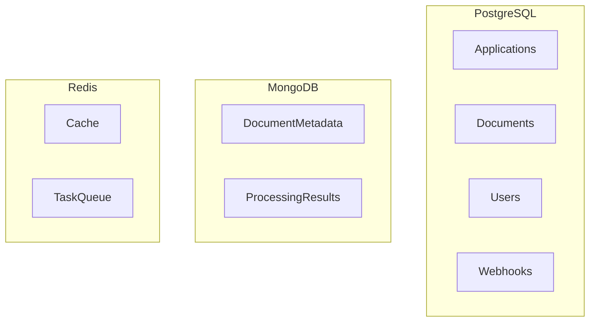
```mermaid
graph TD
    subgraph PostgreSQL
        A[Applications]
        B[Documents]
        C[Users]
        D[Webhooks]
    end
    
    subgraph MongoDB
        E[DocumentMetadata]
        F[ProcessingResults]
    end
    
    subgraph Redis
        G[Cache]
        H[TaskQueue]
    end
```

## THIRD-PARTY SERVICES

### Cloud Infrastructure

| Service | Purpose |
|---------|----------|
| AWS ECS | Container orchestration |
| AWS RDS | Managed PostgreSQL |
| AWS S3 | Document storage |
| AWS SES | Email processing |
| AWS CloudWatch | Monitoring and logging |
| AWS KMS | Key management |

### External Services

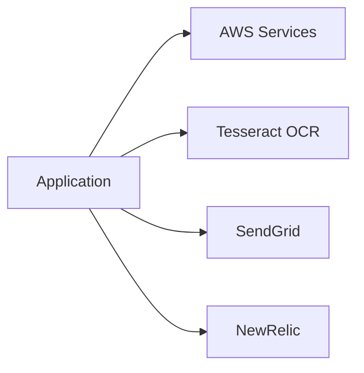
```mermaid
graph LR
    A[Application] --> B[AWS Services]
    A --> C[Tesseract OCR]
    A --> D[SendGrid]
    A --> E[NewRelic]
```

| Service | Purpose | Integration Method |
|---------|----------|-------------------|
| Tesseract OCR | Document text extraction | Self-hosted on ECS |
| SendGrid | Transactional emails | REST API |
| New Relic | Application monitoring | Agent-based |
| AWS Comprehend | Text analysis | AWS SDK |
| AWS Textract | Advanced OCR | AWS SDK |

### Development Tools

| Tool | Purpose |
|------|----------|
| Docker | Containerization |
| Terraform | Infrastructure as code |
| GitHub Actions | CI/CD pipeline |
| SonarQube | Code quality analysis |
| Datadog | Infrastructure monitoring |

Based on the previous sections, I'll generate the SYSTEM DESIGN section focusing on the UI, Database, and API design aspects.

# SYSTEM DESIGN

## USER INTERFACE DESIGN

### Dashboard Layout

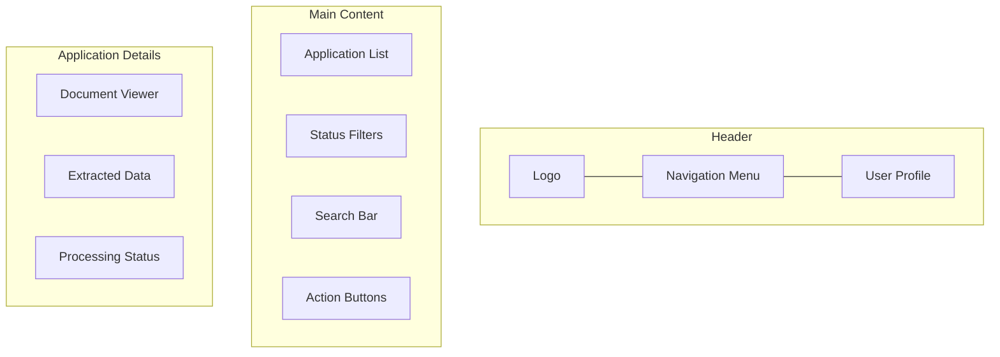
```mermaid
graph TD
    subgraph Header
        A[Logo] --- B[Navigation Menu]
        B --- C[User Profile]
    end
    
    subgraph Main Content
        D[Application List]
        E[Status Filters]
        F[Search Bar]
        G[Action Buttons]
    end
    
    subgraph Application Details
        H[Document Viewer]
        I[Extracted Data]
        J[Processing Status]
    end
```

### Main Dashboard Components

| Component | Description | Actions |
|-----------|-------------|----------|
| Navigation Menu | - Applications<br>- Webhooks<br>- Settings<br>- Reports | - Click to navigate<br>- Dropdown submenus |
| Status Filters | - New<br>- Processing<br>- Complete<br>- Failed | - Toggle filters<br>- Multiple selection |
| Search Bar | - Global search<br>- Advanced filters | - Real-time search<br>- Filter by date range |
| Action Buttons | - Download<br>- Review<br>- Export | - Batch operations<br>- Single item actions |

### Application Details View

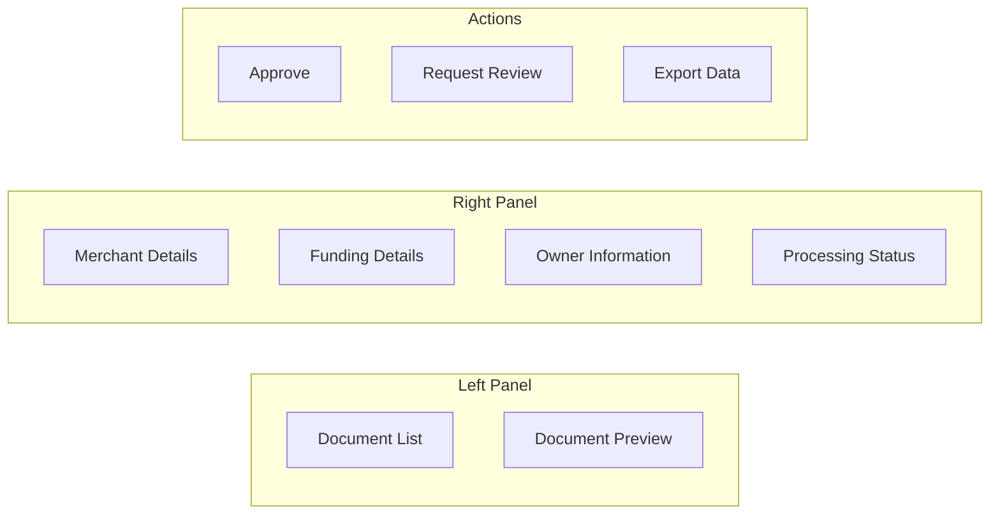
```mermaid
graph LR
    subgraph Left Panel
        A[Document List]
        B[Document Preview]
    end
    
    subgraph Right Panel
        C[Merchant Details]
        D[Funding Details]
        E[Owner Information]
        F[Processing Status]
    end
    
    subgraph Actions
        G[Approve]
        H[Request Review]
        I[Export Data]
    end
```

## DATABASE DESIGN

### Core Schema

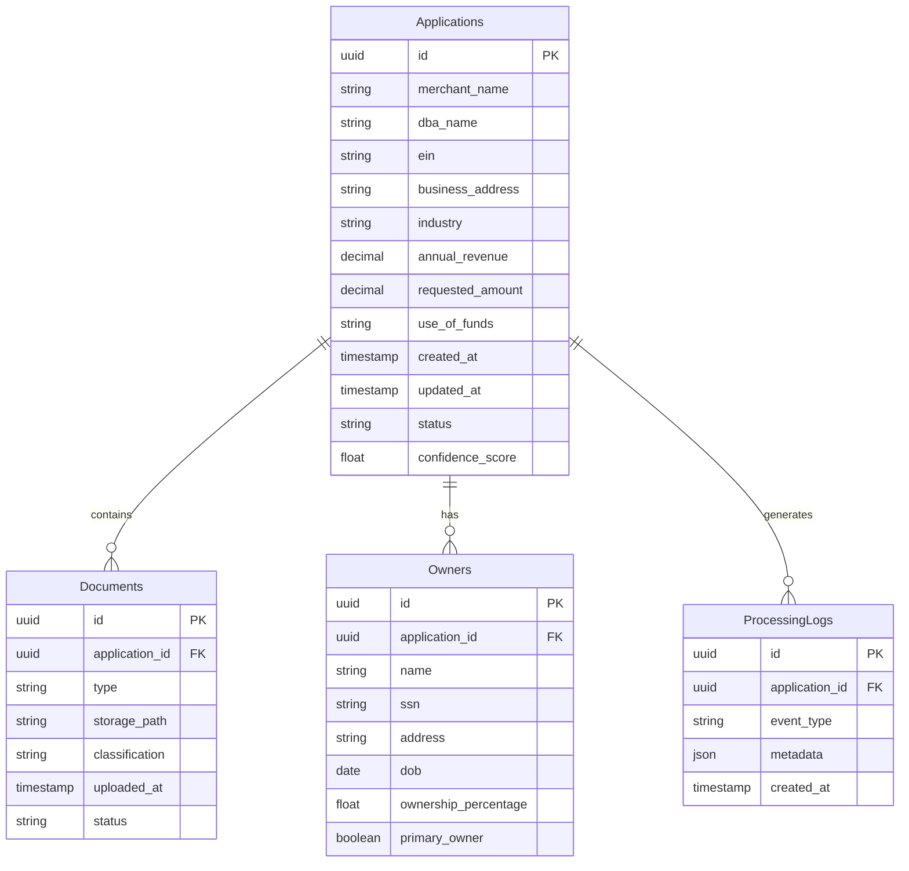
```mermaid
erDiagram
    Applications ||--o{ Documents : contains
    Applications ||--o{ Owners : has
    Applications ||--o{ ProcessingLogs : generates
    Applications {
        uuid id PK
        string merchant_name
        string dba_name
        string ein
        string business_address
        string industry
        decimal annual_revenue
        decimal requested_amount
        string use_of_funds
        timestamp created_at
        timestamp updated_at
        string status
        float confidence_score
    }
    
    Documents {
        uuid id PK
        uuid application_id FK
        string type
        string storage_path
        string classification
        timestamp uploaded_at
        string status
    }
    
    Owners {
        uuid id PK
        uuid application_id FK
        string name
        string ssn
        string address
        date dob
        float ownership_percentage
        boolean primary_owner
    }
    
    ProcessingLogs {
        uuid id PK
        uuid application_id FK
        string event_type
        json metadata
        timestamp created_at
    }
```

### Database Indexes

| Table | Index | Type | Purpose |
|-------|-------|------|---------|
| Applications | merchant_name | B-tree | Search optimization |
| Applications | ein | Hash | Unique lookups |
| Applications | status, created_at | Composite | Status filtering |
| Documents | application_id, type | Composite | Document retrieval |
| Owners | application_id | B-tree | Relationship lookup |
| ProcessingLogs | application_id, created_at | Composite | Log retrieval |

## API DESIGN

### RESTful Endpoints

| Endpoint | Method | Description | Request Body | Response |
|----------|--------|-------------|--------------|-----------|
| `/api/v1/applications` | GET | List applications | Query params | Application list |
| `/api/v1/applications/{id}` | GET | Get application details | - | Application object |
| `/api/v1/applications/{id}/documents` | GET | List application documents | - | Document list |
| `/api/v1/documents/{id}/download` | GET | Get document download URL | - | Presigned URL |
| `/api/v1/webhooks` | POST | Register webhook | Webhook config | Webhook object |
| `/api/v1/webhooks/{id}` | PUT | Update webhook | Webhook config | Updated webhook |

### Webhook Payload Structure

```json
{
  "event": "application.processed",
  "application_id": "uuid",
  "timestamp": "ISO8601",
  "data": {
    "status": "complete",
    "confidence_score": 0.95,
    "merchant_name": "string",
    "ein": "string",
    "requested_amount": "decimal",
    "document_count": "integer"
  },
  "metadata": {
    "processing_time": "float",
    "version": "string"
  }
}
```

### API Authentication

```mermaid
sequenceDiagram
    participant Client
    participant API Gateway
    participant Auth Service
    participant Resource Server
    
    Client->>API Gateway: Request + API Key
    API Gateway->>Auth Service: Validate API Key
    Auth Service-->>API Gateway: JWT Token
    API Gateway->>Resource Server: Request + JWT
    Resource Server-->>API Gateway: Response
    API Gateway-->>Client: Response + Rate Limit Headers
```

### Rate Limiting

| Plan | Rate Limit | Burst Limit |
|------|------------|-------------|
| Basic | 100 req/min | 150 req/min |
| Premium | 500 req/min | 750 req/min |
| Enterprise | 2000 req/min | 3000 req/min |

### Error Responses

```json
{
  "error": {
    "code": "string",
    "message": "string",
    "details": {
      "field": "string",
      "reason": "string"
    },
    "request_id": "uuid"
  }
}
```

# SECURITY CONSIDERATIONS

## AUTHENTICATION AND AUTHORIZATION

### Authentication Flow

```mermaid
sequenceDiagram
    participant User
    participant UI
    participant Auth
    participant API
    participant IAM
    
    User->>UI: Login Request
    UI->>Auth: Forward Credentials
    Auth->>IAM: Validate Credentials
    IAM-->>Auth: Return User Profile
    Auth-->>UI: Issue JWT Token
    UI->>API: Request + JWT
    API->>IAM: Validate Token
    IAM-->>API: Confirm Authorization
    API-->>UI: Protected Resource
```

### Authentication Methods

| Method | Use Case | Implementation |
|--------|----------|----------------|
| JWT Bearer Token | API Access | - 1 hour expiration<br>- RSA-256 signing<br>- Refresh token rotation |
| OAuth2 | SSO Integration | - Azure AD integration<br>- Google Workspace support<br>- SAML2 compatibility |
| API Keys | Webhook Registration | - SHA-256 hashed storage<br>- Automatic rotation every 90 days<br>- Rate limiting per key |
| MFA | Admin Access | - TOTP (Google Authenticator)<br>- SMS backup<br>- Hardware key support |

### Role-Based Access Control

```mermaid
graph TD
    A[User] --> B{Role Assignment}
    B --> C[Admin]
    B --> D[Processor]
    B --> E[Viewer]
    
    C --> F[Full Access]
    D --> G[Process Applications]
    D --> H[View Documents]
    E --> I[Read Only Access]
    
    F --> J[Manage Users]
    F --> K[Configure System]
    F --> L[View Audit Logs]
    
    G --> M[Update Status]
    G --> N[Edit Data]
    
    I --> O[View Applications]
    I --> P[Download Reports]
```

## DATA SECURITY

### Data Classification

| Level | Description | Security Controls |
|-------|-------------|-------------------|
| Level 1 - Critical | SSN, EIN, Banking Details | - Field-level encryption<br>- HSM key management<br>- Audit logging<br>- Access notifications |
| Level 2 - Sensitive | Business Details, Revenue | - Database encryption<br>- Access controls<br>- Audit logging |
| Level 3 - Internal | Application Status, Metadata | - Standard encryption<br>- Role-based access |
| Level 4 - Public | API Documentation, UI Assets | - No encryption required<br>- Public access |

### Encryption Implementation

```mermaid
graph TD
    A[Data Input] --> B{Classification Check}
    B -->|Critical| C[Field-Level Encryption]
    B -->|Sensitive| D[Database Encryption]
    B -->|Internal| E[TLS Protection]
    
    C --> F[AWS KMS]
    F --> G[HSM]
    
    D --> H[AES-256]
    
    E --> I[TLS 1.3]
    
    G --> J[Encrypted Storage]
    H --> J
    I --> K[Secure Transport]
```

### Data Protection Measures

| Layer | Protection Method | Implementation |
|-------|------------------|----------------|
| Transport | TLS 1.3 | - Perfect forward secrecy<br>- Strong cipher suites<br>- Certificate pinning |
| Storage | AES-256 | - Encrypted EBS volumes<br>- S3 server-side encryption<br>- Encrypted backups |
| Application | Field Encryption | - Sensitive field encryption<br>- Secure key rotation<br>- Tokenization |
| Database | Transparent Encryption | - PostgreSQL encryption<br>- MongoDB encryption<br>- Key rotation |

## SECURITY PROTOCOLS

### Security Monitoring

```mermaid
graph LR
    A[System Events] --> B[CloudWatch]
    A --> C[Security Hub]
    
    B --> D[Alerts]
    C --> D
    
    D --> E[Security Team]
    D --> F[Automated Response]
    
    F --> G[Block IP]
    F --> H[Revoke Token]
    F --> I[Scale Defense]
```

### Security Controls

| Control Type | Implementation | Monitoring |
|-------------|----------------|------------|
| Prevention | - WAF rules<br>- IP whitelisting<br>- Rate limiting | Real-time metrics |
| Detection | - GuardDuty<br>- Security Hub<br>- CloudTrail | Daily reports |
| Response | - Automated blocking<br>- Alert escalation<br>- Incident playbooks | Response time tracking |
| Recovery | - Backup restoration<br>- System hardening<br>- Post-incident analysis | Recovery metrics |

### Security Compliance Requirements

| Requirement | Implementation | Validation |
|-------------|----------------|------------|
| SOC 2 Type II | - Access controls<br>- Encryption<br>- Monitoring | Annual audit |
| GDPR | - Data minimization<br>- Right to erasure<br>- Privacy controls | Quarterly review |
| PCI DSS | - Cardholder data security<br>- Network segmentation<br>- Access logging | Monthly scans |
| CCPA | - Data inventory<br>- Consumer rights<br>- Disclosure controls | Bi-annual audit |

### Incident Response Plan

```mermaid
graph TD
    A[Security Event] --> B{Severity Assessment}
    B -->|High| C[Immediate Response]
    B -->|Medium| D[Standard Response]
    B -->|Low| E[Routine Response]
    
    C --> F[System Isolation]
    C --> G[Executive Notice]
    C --> H[Customer Notice]
    
    D --> I[Investigation]
    D --> J[Containment]
    
    E --> K[Logging]
    E --> L[Monitoring]
    
    F --> M[Recovery]
    I --> M
    K --> N[Resolution]
```

### Security Testing Schedule

| Test Type | Frequency | Scope |
|-----------|-----------|-------|
| Penetration Testing | Quarterly | External and internal infrastructure |
| Vulnerability Scanning | Weekly | All system components |
| Security Audit | Annual | Compliance and controls |
| Code Security Review | Per Release | Application code |
| Access Review | Monthly | User permissions and roles |

# INFRASTRUCTURE

## DEPLOYMENT ENVIRONMENT

The Dollar Funding MCA Application Processing System will be deployed entirely on AWS cloud infrastructure using a multi-region architecture for high availability and disaster recovery.

```mermaid
graph TB
    subgraph Primary Region
        A[Production VPC] --> B[Public Subnet]
        A --> C[Private App Subnet]
        A --> D[Private Data Subnet]
        
        B --> E[Load Balancer]
        C --> F[Application Tier]
        D --> G[Database Tier]
    end
    
    subgraph DR Region
        H[DR VPC] --> I[Public Subnet]
        H --> J[Private App Subnet]
        H --> K[Private Data Subnet]
        
        I --> L[Load Balancer]
        J --> M[Application Tier]
        K --> N[Database Tier]
    end
    
    O[Route 53] --> A
    O --> H
```

| Environment | Purpose | Region | Failover |
|------------|---------|--------|-----------|
| Production | Primary workload | us-east-1 | Active |
| Disaster Recovery | Failover | us-west-2 | Passive |
| Development | Feature development | us-east-2 | N/A |
| Staging | Pre-production testing | us-east-1 | N/A |

## CLOUD SERVICES

| Service | Purpose | Configuration |
|---------|---------|--------------|
| AWS ECS | Container orchestration | Fargate launch type |
| AWS RDS | PostgreSQL database | Multi-AZ, 13.x |
| AWS DocumentDB | MongoDB compatible | 5.x cluster |
| AWS S3 | Document storage | Standard + IA tiers |
| AWS SES | Email processing | Configured for submissions@dollarfunding.com |
| AWS CloudFront | Content delivery | Global edge locations |
| AWS KMS | Key management | Automatic rotation |
| AWS WAF | Web application firewall | Custom rule sets |

## CONTAINERIZATION

```mermaid
graph LR
    subgraph Container Registry
        A[ECR Repository]
    end
    
    subgraph Application Containers
        B[Email Service]
        C[Document Service]
        D[OCR Service]
        E[API Service]
        F[UI Service]
    end
    
    subgraph Support Containers
        G[Monitoring]
        H[Logging]
        I[Cache]
    end
    
    A --> B
    A --> C
    A --> D
    A --> E
    A --> F
    A --> G
    A --> H
    A --> I
```

| Container | Base Image | Resource Limits |
|-----------|------------|-----------------|
| Email Service | python:3.9-slim | 2 vCPU, 4GB RAM |
| Document Service | python:3.9-slim | 2 vCPU, 4GB RAM |
| OCR Service | nvidia/cuda:11.0 | 4 vCPU, 8GB RAM |
| API Service | node:16-alpine | 2 vCPU, 4GB RAM |
| UI Service | node:16-alpine | 1 vCPU, 2GB RAM |

## ORCHESTRATION

```mermaid
graph TD
    subgraph ECS Cluster
        A[Service Discovery]
        B[Task Scheduler]
        C[Load Balancer]
        
        subgraph Services
            D[Email Service Tasks]
            E[Document Service Tasks]
            F[OCR Service Tasks]
            G[API Service Tasks]
            H[UI Service Tasks]
        end
    end
    
    A --> D
    A --> E
    A --> F
    A --> G
    A --> H
    
    B --> D
    B --> E
    B --> F
    B --> G
    B --> H
    
    C --> G
    C --> H
```

| Service | Min Tasks | Max Tasks | Auto-scaling Trigger |
|---------|-----------|-----------|---------------------|
| Email Service | 2 | 10 | Queue depth > 100 |
| Document Service | 2 | 10 | CPU > 70% |
| OCR Service | 2 | 8 | Processing backlog > 50 |
| API Service | 3 | 12 | Request count > 1000/min |
| UI Service | 2 | 6 | CPU > 70% |

## CI/CD PIPELINE

```mermaid
graph LR
    A[GitHub] --> B[GitHub Actions]
    B --> C{Tests Pass?}
    C -->|Yes| D[Build Images]
    C -->|No| E[Notify Team]
    D --> F[Push to ECR]
    F --> G{Environment}
    G -->|Dev| H[Deploy to Dev]
    G -->|Staging| I[Deploy to Staging]
    G -->|Prod| J[Deploy to Prod]
    H --> K[Dev Tests]
    I --> L[Integration Tests]
    J --> M[Health Checks]
```

| Stage | Tools | Actions |
|-------|-------|---------|
| Code Analysis | SonarQube | Static code analysis, security scanning |
| Testing | Jest, Pytest | Unit tests, integration tests |
| Security | Snyk, Trivy | Dependency scanning, container scanning |
| Build | Docker | Multi-stage builds, layer optimization |
| Deploy | Terraform | Infrastructure as code deployment |
| Monitor | Datadog | Performance monitoring, alerts |

### Deployment Process

1. Development
   - Automatic deployment on feature branch merge
   - Development environment deployment
   - Integration test execution

2. Staging
   - Manual approval required
   - Full integration test suite
   - Performance testing
   - Security scanning

3. Production
   - Manual approval required
   - Blue-green deployment
   - Automated rollback capability
   - Health check verification

# APPENDICES

## A.1 ADDITIONAL TECHNICAL INFORMATION

### Email Processing Details

```mermaid
flowchart TD
    A[Email Received] --> B{Valid Format?}
    B -->|Yes| C[Extract Metadata]
    B -->|No| D[Error Queue]
    C --> E[Store Message]
    E --> F{Has Attachments?}
    F -->|Yes| G[Process PDFs]
    F -->|No| H[Flag for Review]
    G --> I[Classification]
    I --> J[OCR Queue]
```

### OCR Confidence Scoring Matrix

| Score Range | Action | Review Required |
|-------------|--------|----------------|
| 0.95 - 1.00 | Auto-approve | No |
| 0.85 - 0.94 | Validate critical fields | Partial |
| 0.70 - 0.84 | Manual review | Yes |
| < 0.70 | Rejection | Yes - Full |

### Field Validation Rules

| Field Type | Validation Rule | Example |
|------------|----------------|----------|
| EIN | 9 digits, XX-XXXXXXX format | 12-3456789 |
| SSN | 9 digits, XXX-XX-XXXX format | 123-45-6789 |
| Phone | 10 digits, optional +1 | +1-555-123-4567 |
| Revenue | Numeric, max 12 digits | 1234567.89 |
| Email | RFC 5322 standard | user@domain.com |

## A.2 GLOSSARY

| Term | Definition |
|------|------------|
| Bank Statement | Financial document showing business transaction history |
| Broker | Third-party entity submitting MCA applications |
| Confidence Score | Numerical measure of OCR extraction accuracy |
| Document Classification | Process of categorizing uploaded documents by type |
| Field-Level Encryption | Encryption of specific sensitive data fields |
| Manual Review Queue | Storage for applications requiring human verification |
| Merchant | Business entity applying for cash advance |
| Processing Pipeline | Sequential steps for application processing |
| Validation Rules | Criteria for verifying extracted data accuracy |
| Voided Check | Banking document used to verify account information |

## A.3 ACRONYMS

| Acronym | Full Form |
|---------|-----------|
| AES | Advanced Encryption Standard |
| CCPA | California Consumer Privacy Act |
| DMS | Document Management System |
| ECS | Elastic Container Service |
| GDPR | General Data Protection Regulation |
| HSM | Hardware Security Module |
| IMAP | Internet Message Access Protocol |
| KMS | Key Management Service |
| MFA | Multi-Factor Authentication |
| NLP | Natural Language Processing |
| OCR | Optical Character Recognition |
| PCI | Payment Card Industry |
| REST | Representational State Transfer |
| S3 | Simple Storage Service |
| SES | Simple Email Service |
| SLA | Service Level Agreement |
| SOC | System and Organization Controls |
| SSL | Secure Sockets Layer |
| VPC | Virtual Private Cloud |
| WAF | Web Application Firewall |

## A.4 SYSTEM METRICS

```mermaid
graph LR
    subgraph Performance Metrics
        A[Response Time] --> B[< 500ms]
        C[Throughput] --> D[1000 req/min]
        E[Availability] --> F[99.9%]
    end
    
    subgraph Processing Metrics
        G[OCR Accuracy] --> H[> 95%]
        I[Classification] --> J[> 99%]
        K[Extraction] --> L[> 97%]
    end
    
    subgraph Business Metrics
        M[Automation Rate] --> N[93%]
        O[Error Rate] --> P[< 1%]
        Q[Cost Savings] --> R[87%]
    end
```

## A.5 ERROR CODES

| Code Range | Category | Description |
|------------|----------|-------------|
| 1000-1999 | Email Processing | Email receipt and parsing errors |
| 2000-2999 | Document Processing | PDF handling and storage errors |
| 3000-3999 | OCR Processing | Text extraction and recognition errors |
| 4000-4999 | Data Validation | Field validation and verification errors |
| 5000-5999 | API Errors | REST API and webhook delivery errors |
| 6000-6999 | System Errors | Infrastructure and service errors |